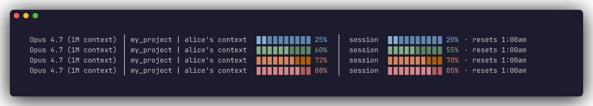

# Claude Code Statusline

> English (current) · [한국어](./README.ko.md)

A minimal [Claude Code](https://claude.com/claude-code) statusline that shows **context window usage** and **5-hour session usage** as color-coded bars with reset time — right at the bottom of your terminal.



Color thresholds (same for context and session):

- `<50%` blue (comfortable) · `<65%` green · `<80%` orange · `≥80%` red

---

## Why I made this

I kept running into the same pain while heavy-using Claude Code.

**1. Watching context fill up.**

Long coding sessions eventually hit the wall where the model starts getting "dumb" — the fix is managing context: `/compact` to compress, dump state to a markdown file and start a fresh session, or `/clear` and carry on. But to do any of that at the right moment, I need to know *right now* how much context I've used. Claude Code's built-in indicator only surfaces at specific thresholds, so I was running `/context` every few minutes to check. I wanted it visible at all times.

**2. The 5-hour session budget burning down.**

Same story. The 5-hour token limit fills faster than you expect. I used to keep Claude Desktop open on a second monitor just to glance at the usage tab. There's `/usage` too, but again — it's on-demand. I wanted a bar that just sits there so I can react before I hit the wall.

**3. Reset time next to the session bar.**

So I know exactly when the limit resets without doing mental math on the clock.

That's it. Three numbers parked at the bottom of the terminal, with color thresholds so peripheral vision picks up the state change.

No external calls, no file I/O, no dependencies beyond Node's built-in `path` module. One file, ~90 lines — easy to audit.

---

## Requirements

- macOS or Linux
- Claude Code **v2.1.x or later** (older versions don't pass `rate_limits` to the statusline — the session block will be hidden, context block still works)
- Node.js 14+ (already required by Claude Code itself)
- A terminal with UTF-8 + ANSI 256-color support (Terminal.app, iTerm2, VS Code integrated terminal — all fine)

---

## Install

### Option A — Let Claude Code do it

1. Clone or download this repo anywhere on your machine.
2. Run Claude Code and `cd` into the folder.
3. Paste this into Claude Code:

   ```
   Follow the "Manual install" steps in this folder's README.md on my machine. Tell me to restart Claude Code when done.
   ```

Claude Code will read the README and run the steps below for you.

### Option B — Manual install

**1. Copy the script into your Claude config dir.**

```bash
mkdir -p ~/.claude
cp statusline.js ~/.claude/statusline.js
chmod +x ~/.claude/statusline.js
```

**2. Find your `settings.json`.**

Claude Code uses `$CLAUDE_CONFIG_DIR/settings.json` if the env var is set, otherwise `~/.claude/settings.json`:

```bash
echo "${CLAUDE_CONFIG_DIR:-$HOME/.claude}/settings.json"
```

**3. Add a `statusLine` block at the JSON root.**

```json
{
  "statusLine": {
    "type": "command",
    "command": "node \"$HOME/.claude/statusline.js\""
  }
}
```

If other settings already exist, just add (or replace) the `statusLine` key — leave everything else alone.

With `jq` this is a one-liner:

```bash
SETTINGS="${CLAUDE_CONFIG_DIR:-$HOME/.claude}/settings.json"
mkdir -p "$(dirname "$SETTINGS")"
[ -f "$SETTINGS" ] || echo '{}' > "$SETTINGS"
TMP=$(mktemp) && jq '.statusLine = {type:"command", command:"node \"$HOME/.claude/statusline.js\""}' "$SETTINGS" > "$TMP" && mv "$TMP" "$SETTINGS"
```

**4. Fully quit Claude Code (Cmd+Q) and relaunch.** The statusline should appear at the bottom.

---

## Verify

Quick smoke test without touching Claude Code:

```bash
echo '{"model":{"display_name":"Opus 4.7"},"workspace":{"current_dir":"/tmp/demo"},"context_window":{"remaining_percentage":80},"rate_limits":{"five_hour":{"used_percentage":35,"resets_at":1776873600}}}' \
  | node ~/.claude/statusline.js
echo
```

You should see a single colored line ending in `… resets 1:00am`.

---

## Uninstall

```bash
# 1. Remove the script
rm ~/.claude/statusline.js

# 2. Remove the statusLine key from settings.json
SETTINGS="${CLAUDE_CONFIG_DIR:-$HOME/.claude}/settings.json"
TMP=$(mktemp) && jq 'del(.statusLine)' "$SETTINGS" > "$TMP" && mv "$TMP" "$SETTINGS"

# 3. Restart Claude Code
```

---

## Troubleshooting

**Restarted but no statusline shows up.**
1. Confirm which settings file you're using: `echo "${CLAUDE_CONFIG_DIR:-$HOME/.claude}/settings.json"`.
2. Open that exact file and check the `statusLine` block is actually there (you may have edited a different one).
3. Test the script in isolation:
   ```bash
   echo '{"model":{"display_name":"test"}}' | node ~/.claude/statusline.js
   ```

**Session block (`│ session … · resets …`) is missing.**
Older Claude Code builds don't pass `rate_limits` to the statusline. Update to **v2.1.x or later**. The context block keeps working on older versions.

**Colors look wrong or characters are garbled.**
Your terminal needs UTF-8 + ANSI 256-color. Terminal.app, iTerm2, VS Code — all supported out of the box.

---

## How the context bar is normalized

Claude Code auto-compacts conversations once the remaining context window drops below ~16.5%. A raw bar based on `remaining_percentage` would hit "100% full" only *after* compaction — not useful.

So the bar rescales:

```
usable_remaining = (remaining_percentage - 16.5) / (100 - 16.5) * 100
ctx_used         = 100 - usable_remaining
```

Meaning: when the bar reads **100%**, you're at the auto-compact boundary — not the hard context ceiling. This matches the user-observable moment things get compacted.

If Anthropic changes the auto-compact threshold, tweak the `AUTO_COMPACT_BUFFER_PCT` constant in `statusline.js`.

---

## Files

- `statusline.js` — the script (~90 lines, Node.js, no dependencies)
- `README.md` — this file
- `README.ko.md` — Korean version
- `demo.png` — screenshot shown above

---

## License

[MIT](./LICENSE) © 2026 Chanyoung Oh
